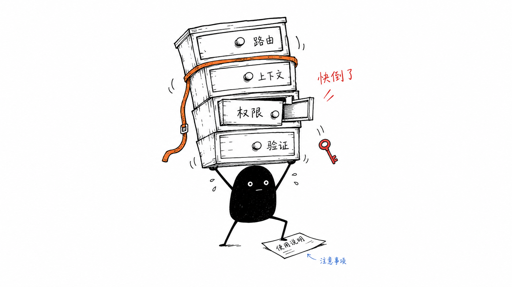
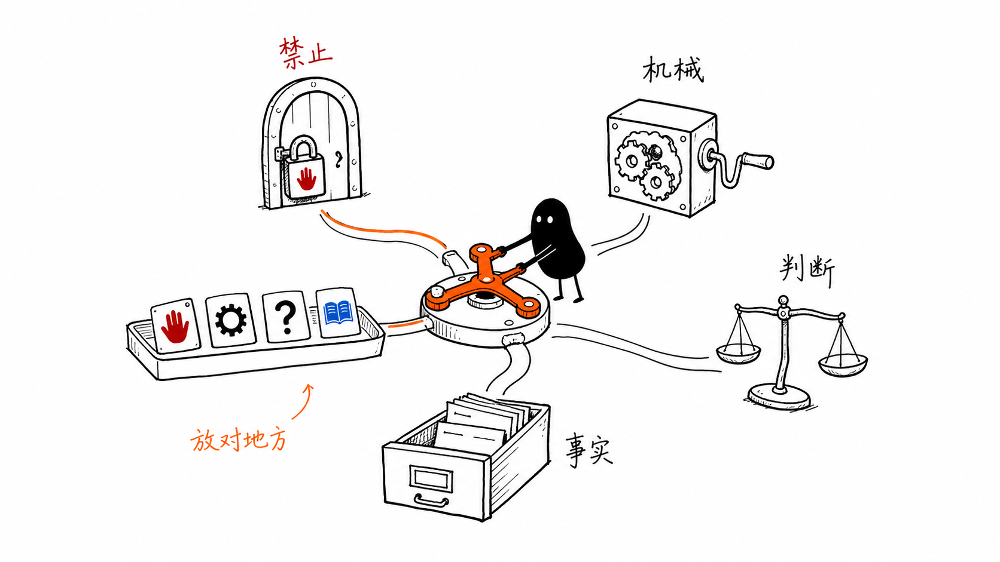

The first version of an agent system often feels wonderfully simple.

A new scenario appears. We write a Skill for it. The Skill explains what to inspect, which tools to use, what good output looks like, and what the agent must never do.

Then another scenario appears, so we add another Skill.

For a while, the library grows and the agent appears to grow with it. But eventually something strange happens: the Skills keep getting better while the system remains unreliable.

The problem is not that we need fewer Skills. It is that we keep asking Skills to manage themselves.

## The Skill worked—until the system grew

Imagine a code review Skill. It contains thoughtful guidance about authorization, tenant isolation, migrations, and evidence. It also says the agent must never push, merge, or modify files during review.

The Skill may be excellent. The system can still fail before the Skill gets a chance to help.

The model may not notice that the Skill applies. It may load the wrong one. It may review a stale commit. It may receive too much irrelevant context or too little relevant context.

Worse, the agent may still possess the tools that the Skill tells it not to use.

At that point, improving the prose inside the Skill is not enough. The failure happened in routing, context, authority, or verification. Those are system problems, not judgment problems.

## A Skill is judgment, not a runtime

I find one distinction useful:

**A Skill is a reusable procedure for making a judgment in a particular kind of situation.**

It can teach an agent what signals matter, how to reason about trade-offs, what evidence to seek, and how to communicate uncertainty.

That is already a large and valuable job. It does not also need to decide when it should be loaded, grant its own permissions, prove its own work, and learn from its own failures.

Those responsibilities belong to the runtime around the Skill: the agent harness.

A harness decides which capability applies, what context it receives, what actions are available, what evidence is required, and when the result must be escalated.

The Skill supplies judgment. The harness makes that judgment operable.

## The four jobs we keep forcing into Skills

When a Skill library is small, it is easy to hide system responsibilities inside natural-language instructions. At scale, four problems become hard to ignore.

### Discovery

A Skill that is not loaded does not exist at runtime.

Descriptions and trigger phrases can help a model notice the right capability, but they are still a probabilistic routing mechanism. Adding more Skills creates more possible matches and more ways to miss.

### Context

Every Skill wants to carry its own little world: architecture notes, policies, tool instructions, examples, exceptions, and safety language.

Much of that material is irrelevant to the task at hand. A better system loads facts and domain guidance only after it knows what kind of situation it is handling.

### Authority

Natural language can request restraint. It cannot enforce restraint.

"Do not push during review" is an instruction. Removing the push capability during review is a control. The first depends on model behavior; the second changes what behavior is possible.

### Learning

When an agent fails, the common response is to append another sentence to the Skill.

But a failure may have nothing to do with the Skill. The router may have selected the wrong domain. A script may have collected stale evidence. A missing gate may have allowed an unsafe action.

Without a replayable test, we cannot even prove that the new sentence fixed the old failure.

## Put each concern in the right material

The most practical improvement is not a more elaborate Skill format. It is to separate concerns by the kind of guarantee they need.

### Gate: what must never happen

If an action must be impossible, enforce that boundary in code or permissions.

A review agent should not merely be reminded not to push, merge, install packages, or edit files. Those actions should be unavailable in review mode.

### Script: what must repeat exactly

Deterministic mechanics belong in deterministic programs.

Freezing a commit SHA, classifying paths, validating a schema, paginating an API, and collecting test output do not benefit from creative interpretation. Scripts make them repeatable and observable.

### Skill: what requires judgment

Skills should own the narrow decisions where domain reasoning matters.

Does this authorization change weaken tenant isolation? Is a migration reversible? Does the evidence support the conclusion? These questions have context, trade-offs, and uncertainty.

### Reference: what is simply true here

Architecture, policy, provenance, and system topology are facts, not procedures.

Keep them as references and load them on demand. A Skill can point to the knowledge it needs without carrying a copy of the entire organization inside itself.

The rule is simple:

**Gates for prohibitions. Scripts for mechanics. Skills for judgment. References for facts.**

## What an agent harness actually does

Return to the code review example. A harness can turn one vague instruction—"review this pull request"—into five observable stages.

### 1. Freeze

Bind every observation to one repository state and one commit SHA. If the pull request changes, the previous evidence becomes stale instead of silently drifting.

### 2. Classify

Use changed paths and repository rules to identify the affected domains. A payment change should route differently from a copy edit or an infrastructure change.

### 3. Load

Load only the Skills and references relevant to those domains. The model receives a smaller, more purposeful context.

### 4. Verify

Require claims to point to evidence. Require the reviewer to state limitations, unresolved questions, and checks it could not perform.

### 5. Verdict

Escalate stale, unclassified, ambiguous, or irreversible cases. "I do not know" becomes a designed system outcome, not a model failure to conceal.

This pipeline does not guarantee that every review is correct. It does something more foundational: it makes the work inspectable.

We can see which commit was reviewed, how the change was classified, which Skills were loaded, what evidence supported the verdict, and where the system gave up.

## Failures should become evals, not more instructions

An agent system improves only when a failure changes the correct layer.

If the relevant Skill was never loaded, fix routing. If evidence was stale, fix the freeze step. If the agent attempted a forbidden action, add or repair a gate.

If the domain judgment itself was poor, then improve the Skill.

The failure should also become a fixture or evaluation case. Replay it after the change, preserve it in a holdout set, and check that the fix generalizes beyond the example that inspired it.

Otherwise the system is not learning. It is accumulating instructions.

## Don't let Skills govern themselves

The deeper shift is from treating a Skill catalog as the operating system to treating it as one layer inside an operating system.

Skills remain essential. They are where domain expertise becomes reusable judgment. But reliability has to live in the relationships between judgment, routing, context, authority, evidence, and feedback.

That is what an agent harness actually solves.

It does not make the model infallible. It makes capability allocatable, constraints enforceable, work observable, and failure replayable.

**Skills for judgment. Harnesses for control. Loops for learning.**

Keep writing Skills. Just stop asking them to govern themselves.
